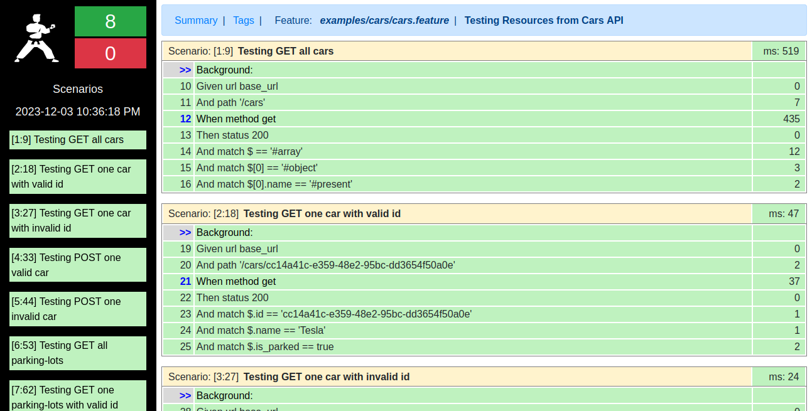

# **API Test with Karate using Cars API**

The goal of this project is testing Cars API. In order to do that, it is necessary to run project present is this <a href="https://github.com/Joaohsd/seminario-s206">link</a>. Just follow the instructions and enjoy the application. I've created **7** tests, using **GET** and **POST** HTTP methods for the entities below.

*   **Cars:**

    *   Testing **GET** all cars: Status **200** as response;
    *   Testing **GET** one car with **valid** id: Status **200** as response;
    *   Testing **GET** one car with **invalid** id: Status **404** as response;
    *   Testing **POST** one **valid** car: Status **201** as response;
    *   Testing **POST** one **invalid** car: Status **400** as response and message verification;

*   **Parking-lots:**

    *   Testing **GET** all parking-lots: Status **200** as response;
    *   Testing **GET** one parking-lots with **valid** id: Status **200** as response;
    *   Testing **GET** one parking-lots with **invalid** id: Status **404** as response;

## **Pre-requirements**

*   JDK (used v17)
*   Maven (used v3.9.5)

## **Running tests**

In order to **Test** the project, use the commands below in this **test_s206** folder of this project:

```shell
mvn test -Dtest=CarsRunner
```

## **Reports**
After running the tests, the reports will be available at **"target/karate-reports/"** folder. Just open the **html** reports file in your browser. When you open, you will see something like that:



