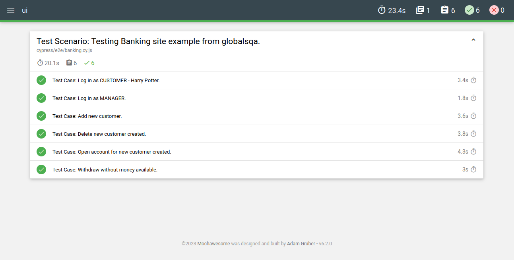

# **UI Test with Cypress and Banking site from globalsqa**

The goal of this project is testing Banking example site. In order to do that, We've created 8 tests cases:

*   Log in as CUSTOMER - Harry Potter;
*   Log in as MANAGER;
*   Add new customer;
*   Delete new customer created;
*   Open account for new customer created;
*   Withdraw without money available;

## **Pre-requirements**

*   Node (used v18.17.1)
*   Npm (used v9.6.7)
*   Cypress (used v13.5.0)
*   Cypress-mochawesome-reporter (used v3.6.1)

## **Node Installation**
If you do not have **node** installed, install it! You can use (**for Linux environment**):

```shell
sudo apt update
sudo apt install nodejs
```
The **npm** already comes with **node**.

If you want to download it from node website. Just access this <a href="https://nodejs.org/en/download/current">link</a> and install the compatible version with your Operating System.

## **Running tests**

In order to **Test** the project, use the commands below in this **ui** folder of this project. Specify the browser that you want to use replacing **"\<browser\>"** for the the browser that you want to use (chrome, firefox, electron or edge):

```shell
npm i
./node_modules/.bin/cypress run --spec 'cypress/e2e/**/' --browser <browser>
```

## **Reports**
After running the tests, the reports will be available at **"cypress/reports/"** folder. Just open the reports in your browser. When you open, you will see something like that:



