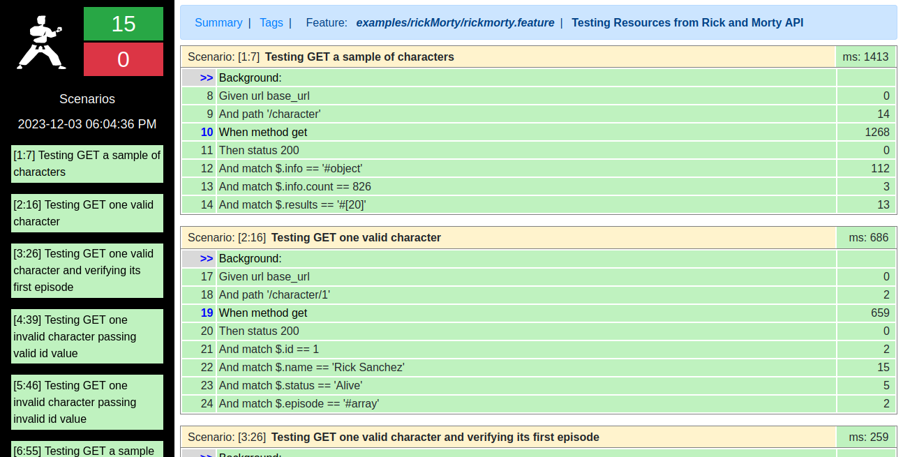

# **API Test with Karate using Rick and Morty API**

The goal of this project is testing Rick and Morty API. In order to do that, We've created 15 tests scenarios, being 5 for each entity:

*   Character:

    *   Testing GET a sample of characters;
    *   Testing GET one valid character;
    *   Testing GET one valid character and verifying its first episode;
    *   Testing GET one **invalid** character passing **valid** id value;
    *   Testing GET one **invalid** character passing **invalid** id value;

*   Episode:

    *   Testing GET a sample of episodes;
    *   Testing GET one valid episode;
    *   Testing GET one valid episode and verifying its first character;
    *   Testing GET one **invalid** episode passing **valid** id value;
    *   Testing GET one **invalid** episode passing **invalid** id value;

*   Location:

    *   Testing GET a sample of locations;
    *   Testing GET one valid location;
    *   Testing GET one valid location and verifying its first resident;
    *   Testing GET one **invalid** location passing **valid** id value;
    *   Testing GET one **invalid** location passing **invalid** id value;

## **Pre-requirements**

*   JDK (used v17)
*   Maven (used v3.9.5)

## **Running tests**

In order to **Test** the project, use the commands below in this **work_s206** folder of this project:

```shell
mvn test -Dtest=RickMortyRunner
```

## **Reports**
After running the tests, the reports will be available at **"target/karate-reports/"** folder. Just open the **html** reports file in your browser. When you open, you will see something like that:



